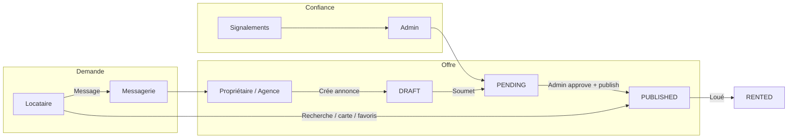

# Homify — Logique métier & perspectives de monétisation

Document d'analyse stratégique basé sur l'état actuel du codebase (Django REST + React/Vite).  
**Marché cible :** Cameroun (Yaoundé, Douala, extension possible).  
**Devise :** FCFA.

---

## 1. Homify aujourd'hui : logique métier

Homify est une **place de marché de location immobilière** qui met en relation **locataires** et **propriétaires**, avec une couche de **confiance** (modération admin, signalements, vérification email).

### Chaîne de valeur



### Acteurs et parcours

| Acteur | Ce qu'il fait sur la plateforme | Valeur perçue |
|--------|----------------------------------|---------------|
| **Locataire** | Recherche, favoris, messages, assistant (budget, marché) | Trouver un logement sans frais d'accès |
| **Propriétaire** | Publie, modifie, marque « loué », reçoit des contacts | Diffuser gratuitement (aujourd'hui) |
| **Admin** | Valide, publie, modère signalements et comptes | Qualité du catalogue |
| **Visiteur** | Landing, inscription | Acquisition |

### Rôles techniques

| Rôle | Description |
|------|-------------|
| **VISITOR** | Compte créé, email non vérifié ; `pending_role` = TENANT ou LANDLORD |
| **TENANT** | Locataire : favoris, messages, signalements |
| **LANDLORD** | Propriétaire : CRUD annonces, marquer « loué » |
| **ADMIN** | Modération annonces, signalements, utilisateurs |

### Flux métier clés (implémentés)

1. **Annonce** : `DRAFT` → `PENDING` → `APPROVED` → `PUBLISHED` → `RENTED` (ou `REJECTED` / `DELETED`)
2. **Découverte** : filtres, carte Leaflet, géolocalisation « près de moi », tri, pagination, compteur de vues
3. **Engagement** : favoris, messagerie (rate limit : 3 msg / 24h / annonce), notifications in-app + email
4. **Confiance** : signalement (fraude, doublon, contenu inapproprié), suspension utilisateur, audit admin
5. **Assistant** : calculateur loyer, stats marché (agrégation sur annonces publiées), recherche filtrée — pas de ML ni paiement

### Cycle de vie d'une annonce (détail)

```
Landlord                    Admin                         Public
  │                           │                              │
  ├─ DRAFT (création)         │                              │
  ├─ submit_for_review ──────► PENDING                       │
  │                           ├─ approve ──► APPROVED        │
  │                           ├─ publish ──► PUBLISHED ─────► visible
  │                           └─ reject ───► REJECTED        │
  ├─ mark_rented (depuis PUBLISHED) ──► RENTED               │
  └─ soft delete ─────────────────────► DELETED              │
```

**Règles métier notables :**
- Minimum **3 photos** à la soumission (max 10 par upload, 5 Mo, JPG/PNG)
- Modération en **2 étapes** : approve puis publish
- Landlord ne peut pas modifier les statuts admin
- Soft delete (pas de suppression physique)

### Positionnement actuel

- **100 % gratuit** pour les locataires (landing, FAQ, assistant)
- **Aucun paiement** dans le code (pas Stripe, Flutterwave, Mobile Money, abonnement)
- Le champ `agency_fees` sur `Property` = **info sur l'annonce** (frais d'agence traditionnels), pas commission Homify
- La transaction réelle (visite, contrat, loyer) se fait **hors plateforme**

### Fichiers clés (référence technique)

| Domaine | Chemin |
|---------|--------|
| Lifecycle annonces | `Backend_homify/apps/core/services/property_lifecycle.py` |
| Modèle Property | `Backend_homify/apps/properties/models.py` |
| Messagerie | `Backend_homify/apps/core/services/messaging.py` |
| Modération | `Frontend_homify/src/screens/AdminModerationScreen.tsx` |
| Landing / positionnement | `Frontend_homify/src/screens/LandingPage.tsx` |
| Roadmap implémentée | `plan.md` |

---

## 2. Atouts déjà construits (monétisables)

| Asset | Pourquoi c'est valuable |
|-------|-------------------------|
| **Catalogue géolocalisé** (ville, quartier, FCFA) | Base pour pub locale, leads, data marché |
| **Modération manuelle** | Différenciation vs annonces Facebook non filtrées |
| **Messagerie + rate limit** | Point de contact mesurable → base pour **leads payants** |
| **Statuts lifecycle** (`PUBLISHED`, `RENTED`) | Permet une **commission au succès** si on formalise la clôture |
| **view_count + favoris** | Signaux d'intention pour **boost d'annonces** |
| **Rôles LANDLORD / ADMIN** | Tiers payant naturel = propriétaires et agences |
| **Notifications + email** | Canal pour upsell (plan Pro, boost) |
| **Admin + audit trail** | Prérequis KYC / badge « vérifié » payant |

---

## 3. État de la monétisation (audit code)

### Recherche effectuée

Termes audités : `stripe`, `payment`, `subscription`, `premium`, `billing`, `commission`, `flutterwave`, `mtn`, `orange money`, etc.

### Résultat : aucune monétisation implémentée

| Signal trouvé | Interprétation |
|---------------|----------------|
| `agency_fees` sur Property | Métadonnée d'annonce, pas collecte par Homify |
| `MortageCalculator.tsx` | Calcul d'emprunt, pas paiement plateforme |
| Copy « gratuit » | Modèle freemium implicite = 100 % gratuit aujourd'hui |
| `requirements.txt` | Pas de librairie paiement |

**Absent du code :**
- Gateway paiement (Stripe, Flutterwave, Mobile Money)
- Abonnement / plan premium
- Facturation landlord
- Commission sur transaction
- Publicité in-app
- Annonces sponsorisées / boost payant

### Écarts produit (opportunités ou dette)

| Feature annoncée | État réel |
|------------------|-----------|
| Connexion sociale | UI seulement — « bientôt disponible » |
| « Recherche intelligente IA » | Filtres REST classiques |
| « Support 24/7 IA » | FAQ locale + webhook n8n optionnel |
| Finalisation location (step 4 landing) | Hors plateforme — pas de contrat ni paiement |
| Annonces vérifiées | Modération manuelle, pas de KYC propriétaire |
| Alertes nouvelles annonces | Préférence en modèle, dispatch non branché |
| Messagerie temps réel | Polling 12s uniquement |

---

## 4. Perspectives de revenus

### 4.1 Annonces premium / boost — Priorité haute

**Modèle :** le propriétaire paie pour plus de visibilité.

| Offre | Exemple | Implémentation Homify |
|-------|---------|------------------------|
| **Mise en tête** | Annonce en haut des résultats 7–30 jours | Champ `is_boosted`, `boost_until`, tri home |
| **Badge « Urgent » / « Premium »** | Mise en avant visuelle | Flag sur `Property` + UI cartes |
| **Photos supplémentaires** | Au-delà de 10 photos | Limite gratuite vs payante |
| **Republication auto** | Remonter après 14 jours | Job Celery + paiement |

**Pourquoi en premier :** pas besoin de gérer le loyer ; modèle connu (Jumia House, Leboncoin Pro) ; s'appuie sur `view_count`, recherche et carte déjà en place.

**Prix indicatif Cameroun :** 2 000 – 15 000 FCFA / boost · 5 000 – 25 000 FCFA / mois « Pro landlord »

---

### 4.2 Abonnement propriétaire / agence — Priorité haute

**Modèle :** freemium landlord.

| Gratuit | Payant (Pro) |
|---------|--------------|
| 1–2 annonces actives | Annonces illimitées |
| Délai modération standard | Priorité modération |
| Stats basiques | Vues, messages, conversion |
| — | Badge « Propriétaire vérifié » |
| — | Export CSV, multi-comptes agence |

**Pourquoi :** les agences à Yaoundé/Douala ont un budget marketing ; aujourd'hui elles paient Facebook ou agents physiques.

**Brique technique :** table `Subscription` (plan, expiry, landlord_id) + garde sur `createProperty`.

---

### 4.3 Leads qualifiés (pay-per-contact) — Priorité moyenne-haute

**Modèle :** les premiers messages sont gratuits ; pour débloquer téléphone/WhatsApp ou contacts illimités, le propriétaire paie par lead.

Homify a déjà :
- messagerie par annonce ;
- masquage partiel du téléphone ;
- compteur de messages.

**Variantes :**
- **Crédits contact** : 500 – 2 000 FCFA / conversation débloquée
- **Forfait mensuel** : X contacts inclus

**Risque :** contournement (échange de numéros au 1er message) → combiner avec rate limit + incitation à rester in-app (historique, preuve en cas de litige).

---

### 4.4 Commission au succès — Priorité moyenne (long terme)

**Modèle :** X % du premier loyer ou frais fixe quand le bien passe à `RENTED` via Homify.

**Prérequis non codés :**
- bouton « Location conclue via Homify » ;
- preuve (contrat upload, confirmation mutuelle) ;
- paiement Mobile Money (MTN / Orange) ou Flutterwave.

**Potentiel :** sur un loyer moyen 150 000 – 400 000 FCFA à Yaoundé, **5–10 % du premier mois** = 7 500 – 40 000 FCFA / transaction.

**Alignement produit :** le statut `RENTED` et `mark_rented` existent déjà — il manque la couche paiement et l'incitation à déclarer.

---

### 4.5 Services à valeur ajoutée — Priorité moyenne

| Service | Client | Revenu |
|---------|--------|--------|
| **Vérification propriétaire (KYC)** | Landlord | 5 000 – 15 000 FCFA / badge annuel |
| **Rapport marché PDF** (quartier, prix/m²) | Investisseur / agence | 10 000 – 50 000 FCFA |
| **Rédaction / mise en forme annonce pro** | Landlord | Forfait one-shot |
| **Visite virtuelle / photos pro** | Partenariat photographe | Commission 15–20 % |

**Atout Homify :** `MarketAnalysis` et données agrégées sont déjà là — packaging B2B possible.

---

### 4.6 Publicité & partenariats — Priorité moyenne (cash-flow rapide)

**Modèle :** revenus indirects, peu de développement.

| Partenaire | Emplacement |
|------------|-------------|
| Banques / microfinance | Assistant IA, calculateur loyer |
| Assurances habitation | Fiche bien, post-inscription |
| Déménagement, internet | Landing, emails |
| Co-working / coliving | Ciblage studios/chambres |

**KPI :** trafic home + `/assist` + emails vérifiés.

---

### 4.7 Data & API B2B — Priorité basse (plus tard)

Vendre des **indicateurs agrégés** (loyer médian par quartier, offre/demande) à :
- promoteurs ;
- ONG logement ;
- municipalités.

Nécessite volume d'annonces et cadre légal (anonymisation).

---

### 4.8 Peu réaliste à court terme

| Idée | Raison |
|------|--------|
| **Paiement du loyer mensuel** via Homify | Régulation, confiance, recouvrement, litiges |
| **« IA » premium** | Aujourd'hui = calculateurs + agrégation ; promettre de l'IA sans backend ML = risque réputation |
| **Hypothèque intégrée** | `MortageCalculator` existe mais n'est pas exposé ; marché prêt ≠ location |

---

## 5. Matrice effort / impact

| Levier | Revenu potentiel | Effort technique | Délai estimé |
|--------|------------------|------------------|--------------|
| Boost annonces | ★★★★ | Faible | 2–4 semaines |
| Abo landlord Pro | ★★★★ | Moyen | 1–2 mois |
| Leads payants | ★★★ | Moyen | 1–2 mois |
| Pub / partenariats | ★★★ | Très faible | Immédiat |
| Commission succès | ★★★★★ | Élevé | 3–6 mois |
| KYC / badge vérifié | ★★ | Moyen | 1–2 mois |
| Data B2B | ★★ | Élevé | 6+ mois |

---

## 6. Roadmap business recommandée

### Phase 1 — Monétisation légère (0–3 mois)

1. Garder locataires **gratuits** (acquisition).
2. Lancer **boost + badge Premium** (Flutterwave / MTN MoMo).
3. **Partenariats** banque/assurance sur `/assist`.
4. Mesurer : vues → messages → `RENTED`.

### Phase 2 — Propriétaires payants (3–6 mois)

1. Plans **Free / Pro / Agence**.
2. **Stats dashboard** (vues, favoris, messages).
3. **Leads** ou contacts débloqués.
4. Badge **propriétaire vérifié** (KYC manuel au début).

### Phase 3 — Transaction (6–12 mois)

1. Déclaration « loué via Homify » + commission.
2. Contrat type / checklist visite (service payant).
3. Alertes **nouvelles annonces** (préférence déjà en modèle) → argument abo locataire **alertes premium**.

---

## 7. KPIs à suivre

| Métrique | Usage |
|----------|--------|
| Annonces `PUBLISHED` actives | Taille de l'offre |
| Ratio messages / annonce | Intention d'achat (lead) |
| Taux `PUBLISHED` → `RENTED` | Succès marketplace |
| Coût d'acquisition landlord | Pricing abonnement |
| Rétention propriétaire (2e annonce) | Product-market fit |
| Temps modération `PENDING` → `PUBLISHED` | Argument plan Pro « priorité » |
| Vues moyennes par annonce | Justification du boost |

---

## 8. Contexte concurrentiel (modèles typiques)

| Modèle | Description | Exemples |
|--------|-------------|----------|
| **Freemium landlord** | Annonces gratuites limitées ; payant pour volume, durée, visibilité | Leboncoin Pro, SeLoger |
| **Annonces premium / boost** | Mise en tête, badge urgent, photos supplémentaires | Jumia House |
| **Commission / success fee** | % sur loyer si location conclue via la plateforme | Airbnb (historique) |
| **Abonnement agences** | CRM, multi-annonces, stats marché | SeLoger Entreprises |
| **Lead generation** | Paiement par contact qualifié | Immoweb |
| **Publicité** | Bannières banques, assurances, déménagement | Portails immo généralistes |
| **Services adjacents** | Estimation pro, visite virtuelle, contrat numérique | Startups proptech |
| **Data / analytics B2B** | Rapports marché pour investisseurs | CoStar, DVF (France) |

---

## 9. Conclusion

Homify est aujourd'hui un **marketplace gratuit et modéré**, solide techniquement, mais **sans couche revenus**. La monétisation la plus naturelle au Cameroun :

1. **Propriétaires et agences** paient pour visibilité et outils (boost + abonnement).
2. **Partenaires** financent l'acquisition locataire (pub, assistant).
3. **Commission au succès** une fois le flux « loué » et Mobile Money en place.

Le positionnement « gratuit pour les locataires » peut rester le moteur d'acquisition ; les revenus viennent du **côté offre** (landlords) et des **partenaires**, pas des locataires au départ.

---

*Document généré à partir de l'analyse du codebase Homify — à mettre à jour au fur et à mesure des évolutions produit.*
